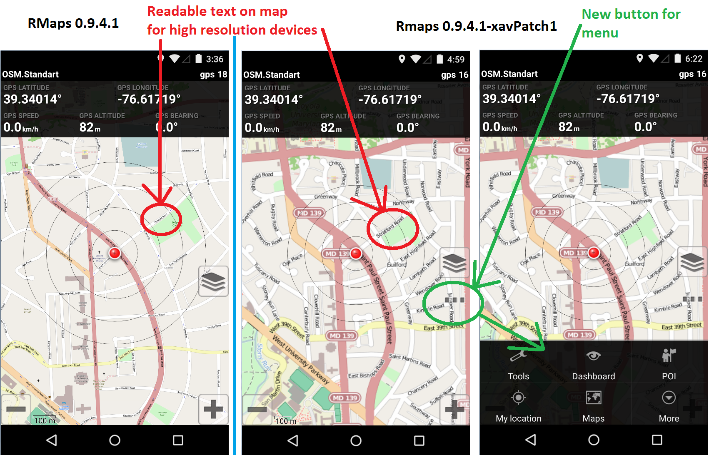

## RMaps-xavPatch
========================

RMaps-xavPatch is a fork from RMaps project (http://robertdeveloper.blogspot.fr/2009/08/rmaps.html).

### Why fork RMaps ?
Because RMaps does not seem maintained (last release : 0.9.4.1 on Jan 13, 2014, last commit : Jan 18, 2014). And, on recents Android devices, there is two main issues :
 - The android Menu button has disappeared.
 - On device screen with hight ppi (Pixels per inch), text on the map is too small (street name...) : for exemple LG G3 : 1440 x 2560, ppi: 538

This fork patch the version 0.9.4.1 (svn revision r703) for have an application without these two problems.

### Screenshots

### Installation
On your android device, before install RMaps-xavPatch :
  - Remove your previous version of RMaps. (Signature is not the same as RMaps official)
  - Check Settings->Security->unknow sources

### License
RMaps and RMaps-xavPatch are licensed under the [GNU GPL v3](http://www.gnu.org/licenses/gpl.html)

### Links
About RMaps : http://robertdeveloper.blogspot.com/2009/08/rmaps.html 
RMaps project updates : http://code.google.com/p/robertprojects/updates/list 
Rmaps source code : http://code.google.com/p/robertprojects/source/checkout 
